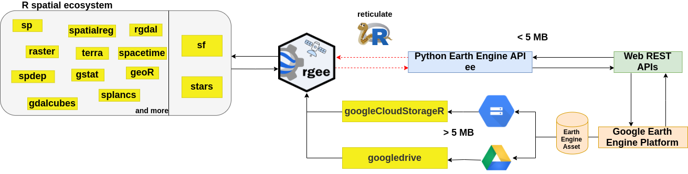

# Exemple : Cas du package **`{rgee}`**

## How does rgee work?

`rgee` n'est pas une API Earth Engine native comme le client `JavaScript` ou `Python`. Développer une API Earth Engine de A à Z engendrerait une charge de maintenance trop importante, d'autant plus que l'API est en cours de développement. Alors, comment exécuter Earth Engine avec R ? La réponse est [**reticulate**](https://rstudio.github.io/reticulate/). Lorsqu'une requête Earth Engine est créée dans R, reticulate la traduit en Python et la transmet à l'API Python Earth Engine, qui la convertit au format JSON. Enfin, la requête est reçue par la plateforme GEE via une API REST Web. La réponse suit le même chemin, mais en sens inverse.

{width="716"} ***workflow***

## Installation

Installez depuis CRAN avec :

```{r eval=FALSE}
install.packages("rgee")
```

Installez les versions de développement depuis GitHub avec :

```{r eval=FALSE}
remotes::install_github("r-spatial/rgee")
```

De plus, `rgee` dépend de numpy et d'earthengine-api et nécessite l'interface de ligne de commande gcloud pour authentifier les nouveaux utilisateurs.

Créez et enregistrez un projet Google Cloud. Suivez les instructions d'accès à Earth Engine.

```{r eval=FALSE}
install.packages("googledrive")

library(rgee)

# Get the username
HOME <- Sys.getenv("HOME")

# 1. Install miniconda
reticulate::install_miniconda()

# 2. Install Google Cloud SDK
system("curl -sSL https://sdk.cloud.google.com | bash")

# 3 Set global parameters
Sys.setenv("RETICULATE_PYTHON" = sprintf("%s/.local/share/r-miniconda/bin/python3", HOME))
Sys.setenv("EARTHENGINE_GCLOUD" = sprintf("%s/google-cloud-sdk/bin/", HOME))

# 4 Install rgee Python dependencies
ee_install() 

# 5. Authenticate and initialize your Earth Engine session
# Replace "my-project-id" with the ID of the Cloud project you created above 
ee_Initialize(project = "my-project-id") 
```

Integrate rgee with geemap :

```{r eval=FALSE}
library(reticulate)
library(rgee)

# 1. Initialize the Python Environment
ee_Initialize(project = "my-project-id")

# 2. Install geemap in the same Python ENV that use rgee
py_install("geemap")
gm <- import("geemap")
```

## Let’s play with some precipitation values

Installez et chargez les packages `tidyverse` et `sf` de R puis initialisez l'API R d'Earth Engine.

```{r eval=FALSE}
library(tidyverse)
library(rgee)
library(sf)

ee_Initialize(project = "my-project-id")
```

Lisez le shapefile `nc` qui contient les délimitation de notre zone de travail:

```{r eval=FALSE}
nc <- st_read(system.file("shape/nc.shp", package = "sf"), quiet = TRUE)
```

Nous utiliserons l' ensemble de données `Terraclimate` pour extraire les précipitations mensuelles (Pr) de 2001

```{r eval=FALSE}
terraclimate <- ee$ImageCollection("IDAHO_EPSCOR/TERRACLIMATE") %>%
  ee$ImageCollection$filterDate("2001-01-01", "2002-01-01") %>%
  ee$ImageCollection$map(function(x) x$select("pr")) %>% # Select only precipitation bands
  ee$ImageCollection$toBands() %>% # from imagecollection to image
  ee$Image$rename(sprintf("PP_%02d",1:12)) # rename the bands of an image
```

`ee_extract`vous aidera à extraire les valeurs mensuelles de précipitations de la `Terraclimate ImageCollection`. `ee_extract` fonctionne de manière similaire à `raster::extract`, il vous suffit de définir : l'objet ImageCollection (x), la géométrie (y) et une fonction pour résumer les valeurs (fun).

```{r eval=FALSE}
ee_nc_rain <- ee_extract(x = terraclimate, y = nc["NAME"], sf = FALSE)
```

Utilisez ggplot2 pour générer un magnifique tracé statique !

```{r eval=FALSE}
ee_nc_rain %>%
  pivot_longer(-NAME, names_to = "month", values_to = "pr") %>%
  mutate(month, month=gsub("PP_", "", month)) %>%
  ggplot(aes(x = month, y = pr, group = NAME, color = pr)) +
  geom_line(alpha = 0.4) +
  xlab("Month") +
  ylab("Precipitation (mm)") +
  theme_minimal()
```

{width="530"}

## Créer une animation NDVI

Installez et chargez `sf`. Après cela, initialisez l'API Earth Engine R :

```{r eval=FALSE}
library(magick)
library(rgee)
library(sf)

ee_Initialize(project = "my-project-id")
```

Définissez les limites régionales des images d'animation et un masque pour découper les données NDVI.

```{r eval=FALSE}
mask <- system.file("shp/arequipa.shp", package = "rgee") %>%
  st_read(quiet = TRUE) %>%
  sf_as_ee()
region <- mask$geometry()$bounds()
```

Récupérez l'ensemble de données `MODIS Terra Vegetation Indices 16-Day Global 1km ee.ImageCollection`, puis sélectionnez la bande NDVI.

```{r eval=FALSE}
col <- ee$ImageCollection('MODIS/006/MOD13A2')$select('NDVI')
Regrouper les images par date composite

col <- col$map(function(img) {
  doy <- ee$Date(img$get('system:time_start'))$getRelative('day', 'year')
  img$set('doy', doy)
})
distinctDOY <- col$filterDate('2013-01-01', '2014-01-01')
```

Maintenant, définissons un filtre qui identifie les images de la collection complète qui correspondent au DOY de la collection DOY distincte.

```{r eval=FALSE}
filter <- ee$Filter$equals(leftField = 'doy', rightField = 'doy')
```

Définissez une jointure et convertissez la `FeatureCollection` résultante en ImageCollection… cela ne vous prendra que 2 lignes de code !

```{r eval=FALSE}
join <- ee$Join$saveAll('doy_matches')
joinCol <- ee$ImageCollection(join$apply(distinctDOY, col, filter))
```

Appliquer une réduction médiane parmi les collections DOY correspondantes.

```{r eval=FALSE}
comp <- joinCol$map(function(img) {
  doyCol = ee$ImageCollection$fromImages(
    img$get('doy_matches')
  )
  doyCol$reduce(ee$Reducer$median())
})
```

Presque prêt ! mais définissons d'abord les paramètres de visualisation `RVB`.

```{r eval=FALSE}
visParams = list(
  min = 0.0,
  max = 9000.0,
  bands = "NDVI_median",
  palette = c(
    'FFFFFF', 'CE7E45', 'DF923D', 'F1B555', 'FCD163', '99B718', '74A901',
    '66A000', '529400', '3E8601', '207401', '056201', '004C00', '023B01',
    '012E01', '011D01', '011301'
  )
)
```

Créez des images de visualisation RVB à utiliser comme images d’animation.

```{r eval=FALSE}
rgbVis <- comp$map(function(img) {
  do.call(img$visualize, visParams) %>%
    ee$Image$clip(mask)
})
```

Animons ceci. Définissons les paramètres de visualisation GIF.

```{r eval=FALSE}
gifParams <- list(
  region = region,
  dimensions = 600,
  crs = 'EPSG:3857',
  framesPerSecond = 10
)
```

Obtenir les noms des mois :

```{r eval=FALSE}
dates_modis_mabbr <- distinctDOY %>%
  ee_get_date_ic %>% # Get Image Collection dates
  '[['("time_start") %>% # Select time_start column
  lubridate::month() %>% # Get the month component of the datetime
  '['(month.abb, .) # subset around month abbreviations
```

Et enfin, utilisez les fonctions ee_utils_gif\_\* pour rendre l'animation GIF et ajouter du texte.

```{r eval=FALSE}
animation <- ee_utils_gif_creator(rgbVis, gifParams, mode = "wb")
animation %>%
  ee_utils_gif_annotate(
    text = "NDVI: MODIS/006/MOD13A2",
    size = 15, color = "white",
    location = "+10+10"
  ) %>%
  ee_utils_gif_annotate(
    text = dates_modis_mabbr,
    size = 30,
    location = "+290+350",
    color = "white",
    font = "arial",
    boxcolor = "#000000"
  ) # -> animation_wtxt

# ee_utils_gif_save(animation_wtxt, path = "raster_as_ee.gif")
```


